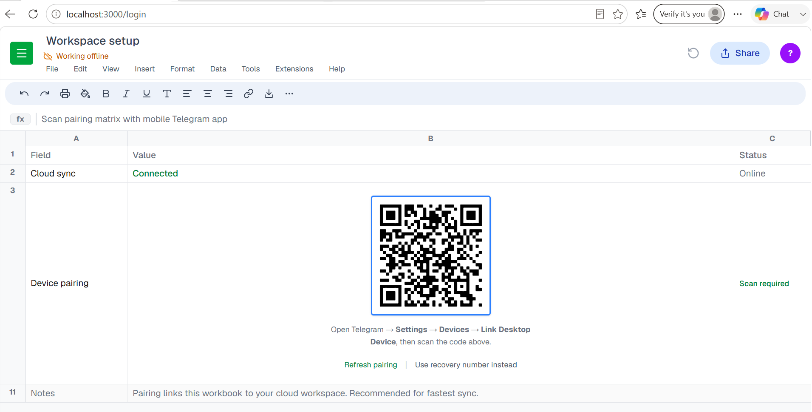

# TeleSheet

This is a **TELEGRAM CLIENT** that has a similar UI to **GOOGLE SHEETS**. It can be run as a local web app.



## Potential Usage

- to pretend you are working but actually chatting with friends;
- to flex to your friends (that you have a much cooler telegram client than theirs)
- to feel like you are still at work while chatting with friends;
- (awaiting for new ideas)

## Requirements

- Node.js 18+
- Age 18+
- A Telegram account
- API credentials from [my.telegram.org](https://my.telegram.org) (API development tools)

## How To Setup

Firstly, pull this github repo to local using:

```bash
https://github.com/alexgoexercise/Tele-Sheet.git
cd .\Tele-Sheet\
```

Downloading the node packages and set up a local .env file:

```bash
npm install
cp .env.example .env
```

Edit `.env` and set your Telegram API credentials (required):

```
TELEGRAM_API_ID=your_numeric_id
TELEGRAM_API_HASH=your_hash
```

Get these from [my.telegram.org](https://my.telegram.org) → API development tools. See the [obtaining API ID guide](https://core.telegram.org/api/obtaining_api_id) for step-by-step instructions.

`.env.example` lists all supported variables. Only `TELEGRAM_API_ID` and `TELEGRAM_API_HASH` are required for local development; the rest have sensible defaults.

```bash
npm run dev
```

Open [http://localhost:3000](http://localhost:3000). The Telegram bridge starts automatically with the app (WebSocket on port 8765). No separate server process is needed.

## Routes


| URL         | Purpose                         |
| ----------- | ------------------------------- |
| `/`         | Spreadsheet UI (requires login) |
| `/login`    | Sign-in page                    |
| `/telegram` | Raw WebSocket debug console     |


Unauthenticated visits to `/` redirect to `/login`.

## Sign in

1. Wait for **Cloud sync** to show **Connected** on the login page.
2. **QR login (default):** scan the pairing code with Telegram on your phone (`Settings → Devices → Link Desktop Device`).
3. **Phone login (fallback):** click **Use recovery number instead**, enter phone, verification code, and 2FA password if enabled.
4. On success you are redirected to the spreadsheet.

Session is saved in `teleproto_data/session.txt` (gitignored). You usually only log in once per machine.

## Using the spreadsheet

- **Sync badge** (under the document title): shows login/sync status. **All changes saved in Drive** means you are connected.
- **File → Disconnect cloud sync…** logs out and returns you to `/login`.
- **Sheet tabs** at the bottom are placeholder UI for now; Telegram chat integration is wired on the backend and ready for frontend work.


## Messaging API (for developers)

The frontend talks to Telegram over WebSocket (`ws://127.0.0.1:8765/ws`). Commands are JSON objects with a `method` field; responses are JSON updates with an `@type` field.

**Frontend hook:**

```tsx
import { useTelegramApi } from './hooks/useTelegramApi';

const api = useTelegramApi((update) => {
  // handle updateNewMessage, updateDialogs, etc.
});

api.getDialogs();
api.openChat(chatId);
api.sendMessage(chatId, 'hello');
api.getMessages(chatId, { limit: 30, offsetId: oldestId });
```

**Key commands:** `getDialogs`, `openChat`, `getMessages`, `sendMessage`, `editMessage`, `deleteMessages`, `markAsRead`, `logOut`

**Live updates:** `updateNewMessage`, `updateMessageEdited`, `updateMessagesDeleted`, `updateMessageRead`

Full TypeScript types: `lib/telegram-api-types.ts`  
Backend handlers: `lib/telegram-bridge.ts`

## Optional environment variables


| Variable                      | Default                  | Description                   |
| ----------------------------- | ------------------------ | ----------------------------- |
| `TELEGRAM_BRIDGE_PORT`        | `8765`                   | WebSocket bridge port         |
| `TELEPROTO_DATA_DIR`          | `./teleproto_data`       | Session storage directory     |
| `NEXT_PUBLIC_TELEGRAM_WS_URL` | `ws://127.0.0.1:8765/ws` | WebSocket URL for the browser |


## Project layout

```
app/
  page.tsx          Spreadsheet UI
  login/page.tsx    Login UI
  providers.tsx     Auth provider (root layout)
lib/
  telegram-bridge.ts   Teleproto + WebSocket server
  telegram-api-types.ts  API types
hooks/
  useTelegramAuth.ts   Auth state + WebSocket
  useTelegramApi.ts    Typed messaging helpers
components/
  AuthGuard.tsx        Redirects unauthenticated users
  SyncStatusBadge.tsx  Login status indicator
  SheetFileMenu.tsx    File menu (logout)
```


## Scripts

```bash
npm run dev      # Development
npm run build    # Production build
npm run start    # Production server
npm run lint     # ESLint
```


## Notes

- `TELEGRAM_API_HASH` must stay in `.env` on the server only; never expose it in client code.
- Logout clears the local session and invalidates the Telegram session.
- `/telegram` is a developer page for inspecting raw WebSocket traffic during auth.

